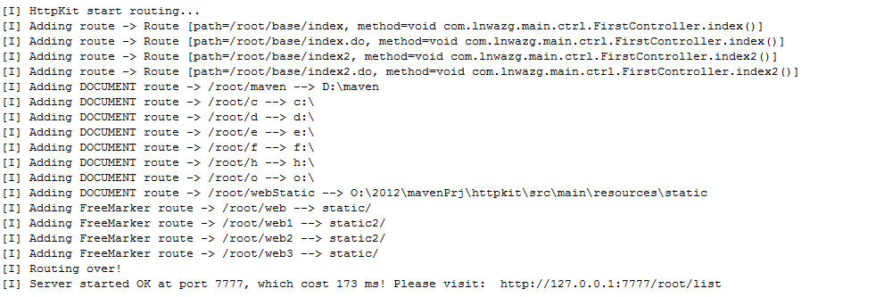
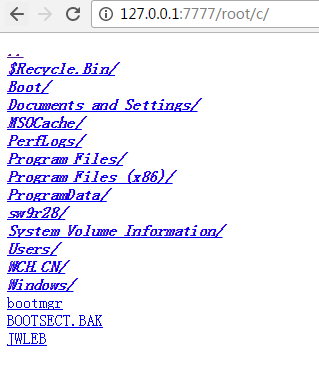
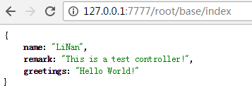

# httpkit
一个精巧的java版http服务器，可替代tomcat、jetty，80ms极速启动。

- 服务器元信息
- 精巧、独立，占用资源少，可替代tomcat
- 80ms极速启动
- 内置风控处理，防瞬时并发量过大崩溃
- 可独立jar包运行，一个jar包就是一个网站！
- 与nginx完美配合
- 内置简洁方便的http文件服务器
- 内置自适应扫描的全盘服务器
- Controller自动扫描，无需显式添加。亦可自定义扫描目录
- 支持path name param
- freemarker模板支持
- 智能跨域处理（属于系统默认的内置过滤器）
- 内置了强大的过滤器支持，可无限扩展，无尽简化你的开发流程
- 可支持多端口启动

### 使用方法

```java
//起一个server实例
int port = 7777;
HttpServer server = HttpServer.bind(port);

//设置上下文路径
server.setContextPath("root");

//设置controller类的扫描包
server.packageSearchAndInit("com.lnwazg.main.ctrl");

//设置自动磁盘扫描
server.autoSearchThenAddWatchResourceDirRoute();

//监听在这个端口处
server.listen();
```

然后访问文件列表：
http://127.0.0.1:7777/root/list

访问具体的控制器
http://127.0.0.1:7777/root/base/index


### Controller类的写法
```java
package com.lnwazg.main.ctrl;

import java.io.File;
import java.util.ArrayList;
import java.util.List;

import com.lnwazg.httpkit.anno.BasePath;
import com.lnwazg.httpkit.controller.Controller;

/**
 * 示例controller<br>
 * 注解指定这个类的path
 * @author nan.li
 * @version 2016年11月30日
 */
@BasePath("/base")
public class FirstController extends Controller
{
    void index()
    {
        //以json形式输出一个对象
        okJson(Maps.asMap("name","LiNan","greetings","Hello World!","remark","This is a test controller!"));
    }

    void index2()
    {
        //输出一个文件
        okFile(new File("c:\\1.jpg"));
    }

    public static class Person
    {
        String name;

        String age;
    }
}

```

### 运行控制台输出：


### 内嵌的资源浏览器


### 执行一个controller，输出一个json对象


### 近期计划
- 强化文档，降低入门难度

### 远期计划：  
- 现有框架为BIO模式，规划整合NIO模式
